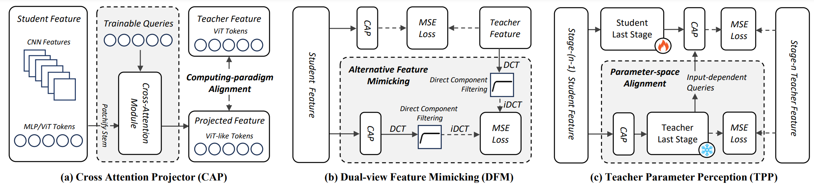
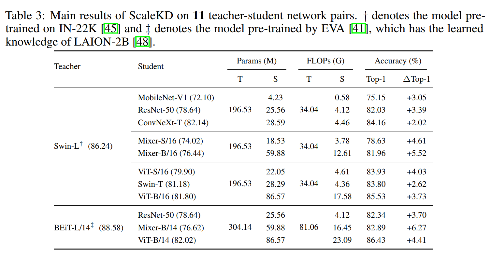
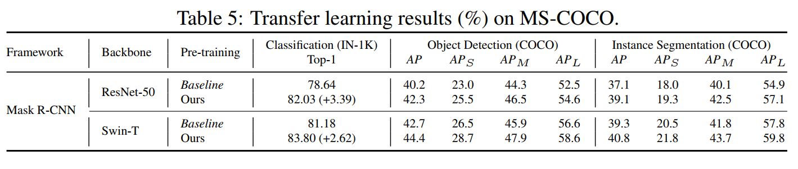
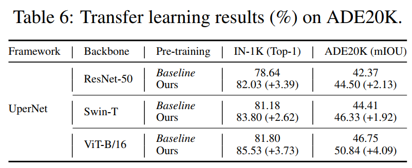

# ScaleKD: Strong Vision Transformers Could Be Excellent Teachers
By Jiawei Fan, Chao Li, Xiaolong Liu and Anbang Yao.

This repository is the official PyTorch implementation of
ScaleKD: Strong Vision Transformers Could Be Excellent Teachers ([paper](https://openreview.net/pdf?id=0WCFI2Qx85), [project](https://deepoptimization.github.io/scalekd/)) published in NeurIPS 2024.


## Update News

**Stay tuned:** We are preparing to release more distilled models on ImageNet-1K and training code on downstream tasks.

- **2024/11/11:** We release two distilled models, ViT-B/16 and ResNet-50. 
- **2024/11/10:** We release the project of ScaleKD, containing our very basic training and evaluation code. 


## Introduction

In this paper, we question if well pre-trained vision transformer (ViT) models could be used as teachers that exhibit scalable properties 
to advance cross architecture knowledge distillation research, in the context of adopting mainstream large-scale visual recognition datasets 
for evaluation. To make this possible, our analysis underlines the importance of seeking effective strategies to align 
(1) feature computing paradigm differences, (2) model scale differences, and (3) knowledge density differences. 
By combining three closely coupled components namely *cross attention projector*, *dual-view feature mimicking* 
and *teacher parameter perception* tailored to address the alignment problems stated above, 
we present a simple and effective knowledge distillation method, called *ScaleKD*. 
Our method can train student backbones that span across a variety of convolutional neural network (CNN), 
multi-layer perceptron (MLP), and ViT architectures on image classification datasets, 
achieving state-of-the-art knowledge distillation performance. 
For instance, taking a well pre-trained Swin-L as the teacher model,
our method gets 75.15%|82.03%|84.16%|78.63%|81.96%|83.93%|83.80%|85.53%
top-1 accuracies for MobileNet-V1|ResNet-50|ConvNeXt-T|Mixer-S/16|MixerB/16|ViT-S/16|Swin-T|ViT-B/16 models trained on ImageNet-1K dataset from
scratch, showing 3.05%|3.39%|2.02%|4.61%|5.52%|4.03%|2.62%|3.73% absolute
gains to the individually trained counterparts. Intriguingly, when scaling up the size
of teacher models or their pre-training datasets, our method showcases the desired
scalable properties, bringing increasingly larger gains to student models. We also
empirically show that the student backbones trained by our method transfer well
on downstream MS-COCO and ADE20K datasets. More importantly, our method
could be used as a more efficient alternative to the time-intensive pre-training
paradigm for any target student model on large-scale datasets if a strong pre-trained
ViT is available, reducing the amount of viewed training samples up to 195×.


Overview of three core components in our ScaleKD, which are (a) cross attention projector,
(b) dual-view feature mimicking, and (c) teacher parameter perception. Note that the teacher model
is frozen in the distillation process and there is no modification to the student’s model at inference.

## Table of content
- [Environment](#environment)
- [Prepare datasets](#dataset)
- [Training](#training)
- [Model Zoo](#zoo)
- [Testing](#testing)
- [Transfering Models](#transfer)


## Requirement and Dataset

### <span id="environment">Environment</span>
- Python 3.8 (Anaconda is recommended)
- CUDA 11.1
- PyTorch 1.10.1
- Torchvision 0.11.2

```
# create conda environment
conda create -n openmmlab python=3.8
# enter the environment
conda activate openmmlab
# install packages
pip install torch==1.10.1+cu111 torchvision==0.11.2+cu111 torchaudio==0.10.1 -f https://download.pytorch.org/whl/cu111/torch_stable.html
pip install -r requirements.txt
```

*Note that using pytorch with higher CUDA versions may result in low training speed.*


### <span id="dataset">Prepare datasets</span> 
- Following [this repository](https://github.com/pytorch/examples/tree/main/imagenet#requirements),
- Download the ImageNet dataset from http://www.image-net.org/.
- Then, move and extract the training and validation images to labeled subfolders, using [the following script](https://github.com/pytorch/examples/blob/main/imagenet/extract_ILSVRC.sh).
- Move the data into folder `data/imagenet`


## <span id="training">How to apply ScaleKD to various teacher-student network pairs</span>
Basically, we peform our experiments with two different training strategies. 

### Training with traditional training strategy
- The experiments based on the traditional training strategy are performed on 8 GPUs from a single node.
- Training configurations for various teacher-student network pairs are in folder `configs/distillers/traditional_traning_strategy/`
- Run distillation by following command:
  ```
    bash tools/dist_train.sh $CONFIG_PATH $NUM_GPU
  ```

- Here, we give an example on running `swin-s_distill_res50_img_s3_s4.py` on 8 GPUs:
  ```
  bash tools/dist_train.sh configs/distillers/traditional_traning_strategy/swin-s_distill_res50_img_s3_s4.py 8
  ```

### Training with advanced training strategy
- The experiments based on the advanced training strategy are performed on 32 GPUs from 4 nodes.
- Training configurations for various teacher-student network pairs are in folder `configs/distillers/advanced_traning_strategy/`
- Run distillation by following command:
  ```
    bash run.sh $CONFIG_PATH $NUM_GPU $NODE_RANK
  ```
- Here, we give an example on running `swin-l_distill_res50_img_s3_s4.py` on 32 GPU from 4 nodes (8 GPUs per node):
  ```
  # Node 1
  bash run.sh configs/distillers/advanced_training_strategy/swin-l_distill_res50_img_s3_s4.py 8 0
  # Node 2
  bash run.sh configs/distillers/advanced_training_strategy/swin-l_distill_res50_img_s3_s4.py 8 1
  # Node 3
  bash run.sh configs/distillers/advanced_training_strategy/swin-l_distill_res50_img_s3_s4.py 8 2
  # Node 4
  bash run.sh configs/distillers/advanced_training_strategy/swin-l_distill_res50_img_s3_s4.py 8 2
  ```
- If you want to adapt these experiments to a single node, please adjust the batch size or learning rate accordingly. And then use similar command as above:
  ```
    bash tools/dist_train.sh $CONFIG_PATH $NUM_GPU
  ```

### <span id="zoo"> Model zoo of distilled models </span>
We also provide some state-of-the-art models trained by our ScaleKD.

|  Model   | Teacher  | Distillation Configurations | Epochs |Top-1 (%) | Weight |
| :------: | :-------: | :-------: | :----------------: | :------------: | :-------: | 
|   ResNet-50   | Swin_L | `configs/distillers/advanced_training_strategy/swin-l_distill_res50_img_s3_s4.py`| 300/600 | 82.03/82.55 | [Google Drive](https://drive.google.com/drive/folders/1K21te80sx3F4YPb7L2QC5tlGKfkQI9Aj?usp=drive_link) |
|   ViT-B/16   | Swin-L | `configs/distillers/advanced_training_strategy/swin-l_distill_deit-b_img_s3_s4.py` | 300 | 85.53 |[Google Drive](https://drive.google.com/file/d/1u1De3OLNYfJt0wRpCQP4V228S1TORYVp/view?usp=drive_link)|


### <span id="testing"> Testing the distilled models</span> 
- Please use the following command to test the performance of models:
  ```
   bash tools/dist_test.sh $CONFIG_PATH $CKPT_PATH 8 --metrics accuracy
  ```
- If you wish to test the originally saved checkpoint, please use the same config as training. And if your checkpoint has been already transferred to student, please use the config as the baseline.

### <span id="transfer"> Obtaining the student weight </span>
Tansfer the distillation model into mmcls (mmpretrain) model
```
python pth_transfer.py --dis_path $CKPT_PATH --output_path $NEW_CKPT_PATH
```


## Main Results

### Results on ImageNet-1K

<div align=center>  </div> 

### Transfer learning on Downsteam tasks

#### Object Detection and Instance Segmentation on MS-COCO
<div align=center>  </div> 

#### Semantic Segmentation on ADE20K
<div align=center>  </div> 


## Citation
```
@article{fan2024scalekd,
  title={ScaleKD: Strong Vision Transformers Could Be Excellent Teachers},
  author={Fan, Jiawei and Li, Chao and Liu, Xiaolong and Yao, Anabang},
  journal={Thirty-eighth Conference on Neural Information Processing Systems},
  year={2024}
}
```


## License
ScaleKD is released under the Apache license. We encourage use for both research and commercial purposes, as long as proper attribution is given.


## Acknowledgement
This repository is built based on [mmpretrain repository](https://github.com/open-mmlab/mmpretrain) and [cls_KD repository](https://github.com/yzd-v/cls_KD). We thank the authors of the two repositories for releasing their amazing codes.
