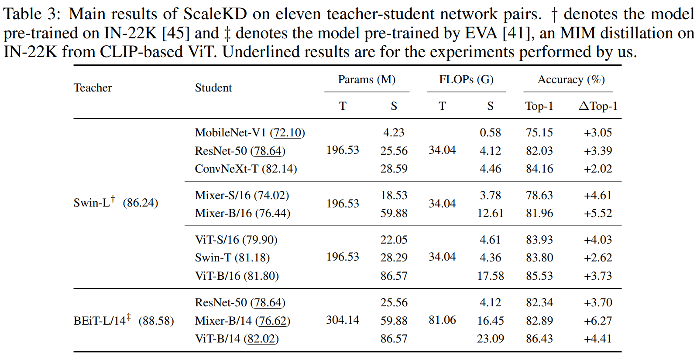

# ScaleKD: Strong Vision Transformers Could Be Excellent Teachers
By Jiawei Fan, Chao Li, Xiaolong Liu and Anbang Yao.

This repository is the official PyTorch implementation 
ScaleKD (ScaleKD: Strong Vision Transformers Could Be Excellent Teachers) published in NeurIPS 2024.

In this paper, we question if well pre-trained vision transformer (ViT) models could be used as teachers that exhibit scalable properties 
to advance cross architecture knowledge distillation research, in the context of adopting mainstream large-scale visual recognition datasets for evaluation.
To make this possible, our analysis underlines the importance of seeking effective strategies to align (1) feature computing paradigm differences, (2) model scale differences, and (3) knowledge density differences. By combining three closely coupled components namely *cross attention projector*, *dual-view feature mimicking* and *teacher parameter perception* tailored to address the alignment problems stated above, we present a simple and effective knowledge distillation method, called *ScaleKD*. Our method can train student backbones that span across a variety of convolutional neural network (CNN), multi-layer perceptron (MLP), and ViT architectures on image classification datasets, achieving state-of-the-art knowledge distillation performance. For instance, taking a well-trained Swin-L as the teacher model, our method gets 75.15\%$|$82.03\%$|$84.16\%$|$78.63\%$|$81.96\%$|$83.93\%$|$83.80\%$|$85.53\% top-1 accuracies for MobileNet-V1$|$ResNet-50$|$ConvNeXt-T$|$Mixer-S/16$|$Mixer-B/16$|$ViT-S/16$|$Swin-T$|$ViT-B/16 models trained on ImageNet-1K dataset from scratch, showing 3.05\%$|$3.39\%$|$2.02\%$|$4.61\%$|$5.52\%$|$4.03\%$|$2.62\%$|$3.73\% absolute gains to the individually trained counterparts. % with the same experimental settings. 
Intriguingly, when scaling up the size of teacher models or their pre-training datasets, our method showcases the desired scalable properties, bringing increasingly larger gains to student models. We also empirically show that the student backbones trained by our method transfer well on downstream MS-COCO and ADE20K datasets.More importantly, our method could be used as a more efficient alternative way to the time-intensive pre-training paradigm for any target student model on large-scale datasets if a strong pre-trained ViT is available, reducing the amount of viewed training samples up to 195$\times$.


test1 test1 test1


## Requirements
- Python 3.8 (Anaconda is recommended)
- CUDA 11.1
- PyTorch 1.10.1
- Torchvision 0.11.2

```
pip install torch==1.10.1+cu111 torchvision==0.11.2+cu111 torchaudio==0.10.1 -f https://download.pytorch.org/whl/cu111/torch_stable.html
pip install -r requirements.txt
```

*Note that using pytorch with higher CUDA version may result in low training speed*


## Prepare Datasets

- Following [this repository](https://github.com/pytorch/examples/tree/main/imagenet#requirements),
- Download the ImageNet dataset from http://www.image-net.org/.
- Then, move and extract the training and validation images to labeled subfolders, using [the following script](https://github.com/pytorch/examples/blob/main/imagenet/extract_ILSVRC.sh).
- Move the data into folder `data/imagenet`


## Train
The experiments based on the traditional training strategy are performed on 8 GPUs from a single node.
```
#Traditional Training Strategy
bash tools/dist_train.sh configs/distillers/traditional_traning_strategy/swin-s_distill_res50_img_s3_s4.py 8
```

The experiments based on the advanced training strategy are performed on 32 GPUs from 4 nodes.
Here we provide an example of our training scripts:
```
#Advanced Training Strategy
bash run.sh
```
**Note that the training setups of advanced training strategy are for 32 GPUs. If you want to adapt to 8 GPUs from a single node, please adjust the batch size or learning rate accordingly.**


## Transfer
```
# Tansfer the Distillation model into mmcls model
python pth_transfer.py --dis_path $dis_ckpt --output_path $new_mmcls_ckpt
```
## Test

```
#multi GPU
bash tools/dist_test.sh configs/deit/deit-tiny_pt-4xb256_in1k.py $new_mmcls_ckpt 8 --metrics accuracy
```


## Results



<!-- |  Model   | Teacher  | T_weight  | Baseline | ViTKD | weight | ViTKD+NKD | weight |                            dis_config                            |
| :------: | :-------: | :-------: | :----------------: | :------------: | :--: | :--: | :--: | :----------------------------------------------------------: |
|   DeiT-Tiny   | DeiT III-Small | [baidu](https://pan.baidu.com/s/1asMuS6E7OmdZzQBH9ugCZg?pwd=83x7)/[one drive](https://1drv.ms/u/s!Ah7OVljahSArnWHFQNy6OqrZoA82?e=eQ4kmI) |        74.42        |      76.06 (+1.64)      |[baidu](https://pan.baidu.com/s/1OYGeZ2P8RRdEIWM3diyzQA?pwd=niiw)/[one drive](https://1drv.ms/u/s!Ah7OVljahSArnVz0irqzX2VP0tg_?e=75Vfs6) |77.78 (+3.36)| [baidu](https://pan.baidu.com/s/1StOAQziPEvvHzQqWvy20vQ?pwd=emct)/[one drive](https://1drv.ms/u/s!Ah7OVljahSArnV1cQsVw9SHvSWpG?e=RuE1aL) | [config](https://github.com/yzd-v/cls_KD/blob/master/configs/distillers/imagenet/deit-s3_distill_deit-t_img.py) |
|   DeiT-Small   | DeiT III-Base | [baidu](https://pan.baidu.com/s/15HNMudacNlBUCZ6ySFhENg?pwd=6mmp)/[one drive](https://1drv.ms/u/s!Ah7OVljahSArnWTTrFh-ST9BcHb8?e=wj3iqH) |        80.55        |      81.95 (+1.40)      |[baidu](https://pan.baidu.com/s/17O64Q4py6Ex1ohjnrPpiew?pwd=4srr)/[one drive](https://1drv.ms/u/s!Ah7OVljahSArnV4Fb5EIZEf81PxK?e=K7M1Sz) |83.59 (+3.04)| [baidu](https://pan.baidu.com/s/1OThOyOR60CCxszxB6rY4QQ?pwd=4x90)/[one drive](https://1drv.ms/u/s!Ah7OVljahSArnV_tNpvVZ21Yc9eM?e=vlYr8K) | [config](https://github.com/yzd-v/cls_KD/blob/master/configs/distillers/imagenet/deit-b3_distill_deit-s_img.py) |
|   DeiT-Base   | DeiT III-Large | [baidu](https://pan.baidu.com/s/1qdgcTMz_FeBfEH2rchh_yg?pwd=n5hf)/[one drive](https://1drv.ms/u/s!Ah7OVljahSArnWaR3tslskypZbwB?e=D1aL6p) |        81.76        |      83.46 (+1.70)      |[baidu](https://pan.baidu.com/s/1Qytl5BHpc3qdlYSQq750FQ?pwd=ej2k)/[one drive](https://1drv.ms/u/s!Ah7OVljahSArnWMMyJZT2NlsIgBg?e=JM5L9h) |85.41 (+3.65)| [baidu](https://pan.baidu.com/s/19Zxq4g3Z1mGhDPjkbG_t0g?pwd=q915)/[one drive](https://1drv.ms/u/s!Ah7OVljahSArnWJvNpY3Feo_OvGi?e=iPuWJu) | [config](https://github.com/yzd-v/cls_KD/blob/master/configs/distillers/imagenet/deit-l3_distill_deit-b_img.py) | -->

## Citation
```
@article{fan2024scalekd,
  title={ScaleKD: Strong Vision Transformers Could Be Excellent Teachersaa},
  author={Fan, Jiawei and Li, Chao and Liu, Xiaolong and Yao, Anabang},
  journal={Thirty-eighth Conference on Neural Information Processing Systems},
  year={2024}
}
```
